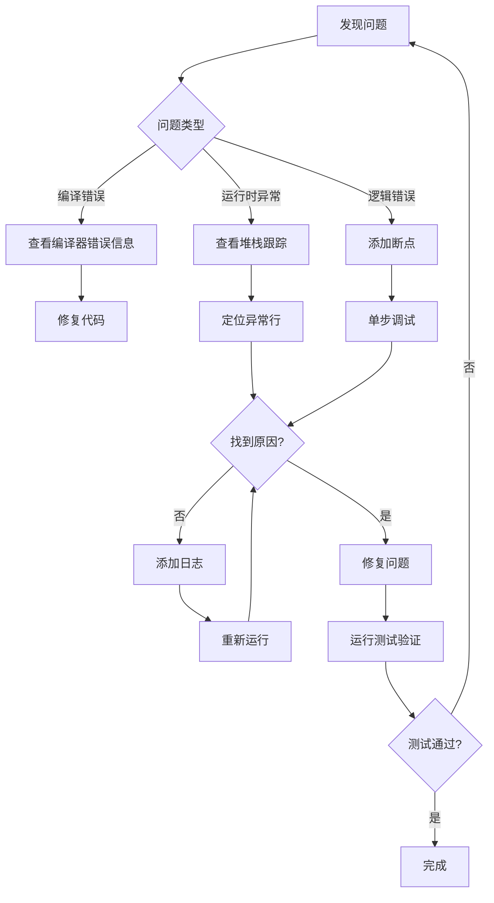

# 充电订单系统调试指南
## Charging Order System Debug Guide

---

## 📋 目录

1. [IDE 断点调试](#1-ide-断点调试推荐)
2. [日志调试](#2-日志调试)
3. [单元测试调试](#3-单元测试调试)
4. [远程调试](#4-远程调试)
5. [COLA 状态机调试](#5-cola-状态机调试)
6. [常见问题排查](#6-常见问题排查)

---

## 1. IDE 断点调试（推荐）

### 1.1 IntelliJ IDEA 调试步骤

#### **设置断点的关键位置**

建议在以下位置设置断点：

```java
// 1. ChargingOrderService.java
public ChargingOrder pay(ChargingOrder order, BigDecimal prepaidAmount) {
    validatePaymentType(order, PaymentType.PRE_PAID);  // ← 设置断点
    
    order.setPrepaidAmount(prepaidAmount);
    OrderState newState = fireEvent(order, OrderEvent.PAY);  // ← 设置断点
    // ...
}

// 2. 状态机触发处
private OrderState fireEvent(ChargingOrder order, OrderEvent event) {
    PaymentStrategy strategy = strategyFactory.getStrategy(order.getPaymentType());  // ← 设置断点
    StateMachine<OrderState, OrderEvent, ChargingOrder> stateMachine = strategy.buildStateMachine();
    OrderState newState = stateMachine.fireEvent(order.getState(), event, order);  // ← 设置断点
    return newState;
}

// 3. 策略模式实现类
// PrePaidStrategy.java / PostPaidStrategy.java 的 buildStateMachine() 方法
```

#### **调试快捷键**

| 操作 | Windows/Linux | macOS |
|------|--------------|-------|
| 调试运行 | `Shift + F9` | `Ctrl + D` |
| 单步跳过 | `F8` | `F8` |
| 单步进入 | `F7` | `F7` |
| 单步跳出 | `Shift + F8` | `Shift + F8` |
| 恢复程序 | `F9` | `Cmd + Option + R` |
| 查看表达式 | `Alt + F8` | `Option + F8` |

#### **调试技巧**

1. **条件断点**
   - 右键断点 → 添加条件
   - 例如：`order.getOrderId().equals("specific-id")`

2. **日志断点（非侵入式日志）**
   - 右键断点 → 取消勾选 "Suspend"
   - 勾选 "Evaluate and log"
   - 输入表达式：`"Order state: " + order.getState()`

3. **监视表达式**
   - 在 Watches 面板添加：
     ```
     order.getState()
     order.getPaymentType()
     order.getPrepaidAmount()
     ```

---

## 2. 日志调试

### 2.1 日志级别配置

已配置日志文件：`src/main/resources/logback-spring.xml`

```xml
<!-- 你的业务包日志级别 -->
<logger name="com.charging.order" level="DEBUG"/>

<!-- COLA 状态机日志 -->
<logger name="com.alibaba.cola.statemachine" level="DEBUG"/>
```

### 2.2 查看日志输出

#### **控制台输出**
运行测试时，控制台会显示详细的日志：

```log
2025-12-26 02:26:34.123 [main] INFO  c.charging.order.service.ChargingOrderService - Created PRE_PAID order: abc-123
2025-12-26 02:26:34.456 [main] INFO  c.charging.order.service.ChargingOrderService - Order abc-123 paid with amount: 100.00
2025-12-26 02:26:34.789 [main] DEBUG c.charging.order.service.ChargingOrderService - State machine [PrePaidStateMachine] fired event PAY for order abc-123: CREATED -> PAID
```

#### **文件输出**
日志文件位置：`logs/charging-order-system.log`

```bash
# 实时查看日志（macOS/Linux）
tail -f logs/charging-order-system.log

# 搜索特定订单的日志
grep "abc-123" logs/charging-order-system.log
```

### 2.3 临时增强日志

如果需要更详细的调试信息，可以临时添加日志：

```java
public ChargingOrder pay(ChargingOrder order, BigDecimal prepaidAmount) {
    log.debug("=== PAY METHOD START ===");
    log.debug("Order ID: {}", order.getOrderId());
    log.debug("Current State: {}", order.getState());
    log.debug("Payment Type: {}", order.getPaymentType());
    log.debug("Prepaid Amount: {}", prepaidAmount);
    
    validatePaymentType(order, PaymentType.PRE_PAID);
    
    log.debug("Validation passed, setting prepaid amount");
    order.setPrepaidAmount(prepaidAmount);
    
    log.debug("Firing PAY event to state machine");
    OrderState newState = fireEvent(order, OrderEvent.PAY);
    
    log.debug("New state: {}", newState);
    order.setState(newState);
    
    log.debug("=== PAY METHOD END ===");
    return order;
}
```

---

## 3. 单元测试调试

### 3.1 运行单个测试方法

```bash
# 方式1：命令行运行
mvn test -Dtest=ChargingOrderServiceTest#testPrePaidOrderLifecycle

# 方式2：IDEA 中右键测试方法 → Debug 'testPrePaidOrderLifecycle()'
```

### 3.2 测试调试最佳实践

**在测试代码中添加断言和日志：**

```java
@Test
void testPrePaidOrderLifecycle() {
    // 1. 创建先付订单
    ChargingOrder order = chargingOrderService.createOrder(
            "user123", "pile456", PaymentType.PRE_PAID);
    
    System.out.println(">>> Step 1: Order created - " + order);  // ← 调试输出
    assertNotNull(order);
    assertEquals(OrderState.CREATED, order.getState());

    // 2. 支付
    order = chargingOrderService.pay(order, new BigDecimal("100.00"));
    
    System.out.println(">>> Step 2: Order paid - " + order);  // ← 调试输出
    assertEquals(OrderState.PAID, order.getState());
    
    // ... 其他步骤类似
}
```

### 3.3 使用 @Before 和 @After 进行测试隔离

```java
@BeforeEach
void setUp() {
    log.info("========== TEST START ==========");
}

@AfterEach
void tearDown() {
    log.info("========== TEST END ==========");
}
```

---

## 4. 远程调试

### 4.1 启动应用时开启远程调试

```bash
# 添加 JVM 参数启动应用
java -agentlib:jdwp=transport=dt_socket,server=y,suspend=n,address=5005 -jar target/charging-order-system.jar
```

### 4.2 IDEA 配置远程调试

1. **Run → Edit Configurations**
2. **添加 Remote JVM Debug**
3. **配置参数：**
   - Host: `localhost`
   - Port: `5005`
   - Debugger mode: `Attach to remote JVM`
4. **点击 Debug 按钮连接**

---

## 5. COLA 状态机调试

### 5.1 查看状态机配置

在策略实现类中查看状态机的构建逻辑：

```java
// 在 PrePaidStrategy.buildStateMachine() 中设置断点
StateMachineBuilder<OrderState, OrderEvent, ChargingOrder> builder = 
    StateMachineBuilderFactory.create();

// 查看每个转换的配置
builder.externalTransition()
    .from(OrderState.CREATED)    // ← 查看起始状态
    .to(OrderState.PAID)         // ← 查看目标状态
    .on(OrderEvent.PAY)          // ← 查看触发事件
    .when(checkCondition())      // ← 查看条件
    .perform(doAction());        // ← 查看动作
```

### 5.2 状态机执行追踪

```java
private OrderState fireEvent(ChargingOrder order, OrderEvent event) {
    PaymentStrategy strategy = strategyFactory.getStrategy(order.getPaymentType());
    
    // 添加详细日志
    log.debug("┌─────────────────────────────────────");
    log.debug("│ State Machine Execution");
    log.debug("│ Machine ID: {}", strategy.getMachineId());
    log.debug("│ Order ID: {}", order.getOrderId());
    log.debug("│ Current State: {}", order.getState());
    log.debug("│ Event: {}", event);
    
    StateMachine<OrderState, OrderEvent, ChargingOrder> stateMachine = strategy.buildStateMachine();
    OrderState newState = stateMachine.fireEvent(order.getState(), event, order);
    
    log.debug("│ New State: {}", newState);
    log.debug("└─────────────────────────────────────");
    
    return newState;
}
```

### 5.3 状态机可视化

创建一个测试方法生成状态机图：

```java
@Test
void visualizeStateMachine() {
    PaymentStrategy prePaidStrategy = strategyFactory.getStrategy(PaymentType.PRE_PAID);
    StateMachine<OrderState, OrderEvent, ChargingOrder> stateMachine = 
        prePaidStrategy.buildStateMachine();
    
    // COLA 支持生成 PlantUML 格式图
    String plantUML = stateMachine.generatePlantUML();
    System.out.println(plantUML);
}
```

---

## 6. 常见问题排查

### 6.1 状态转换失败

**问题现象：**
```
Exception: Cannot fire event PAY on state CREATED
```

**排查步骤：**

1. **检查状态机配置**
   - 确认 `CREATED` → `PAY` 的转换是否已定义
   - 查看 `PrePaidStrategy.buildStateMachine()`

2. **检查条件（when）**
   - 在 `.when()` 方法中添加日志
   - 确认条件是否返回 `true`

3. **检查订单状态**
   - 打印 `order.getState()` 确认当前状态
   - 确认状态值是否正确

### 6.2 跨策略调用

**问题现象：**
```
IllegalStateException: Order xxx is POST_PAID mode, cannot perform PRE_PAID mode operation
```

**排查方法：**

```java
// 在调用前检查支付类型
log.info("Order payment type: {}", order.getPaymentType());

if (order.getPaymentType() == PaymentType.PRE_PAID) {
    chargingOrderService.pay(order, amount);
} else {
    chargingOrderService.authorize(order);
}
```

### 6.3 空指针异常 (NullPointerException)

**常见位置：**

1. **订单对象为 null**
   ```java
   // 添加空值检查
   if (order == null) {
       log.error("Order is null!");
       throw new IllegalArgumentException("Order cannot be null");
   }
   ```

2. **金额字段未初始化**
   ```java
   // 检查字段是否为 null
   if (order.getPrepaidAmount() == null) {
       order.setPrepaidAmount(BigDecimal.ZERO);
   }
   ```

### 6.4 测试失败

**逐步验证：**

```java
@Test
void debugTest() {
    // Step 1: 创建订单
    ChargingOrder order = chargingOrderService.createOrder(
        "user123", "pile456", PaymentType.PRE_PAID);
    
    assertNotNull(order, "Order should not be null");
    assertNotNull(order.getOrderId(), "Order ID should not be null");
    assertEquals(OrderState.CREATED, order.getState(), 
        "Initial state should be CREATED");
    
    // Step 2: 支付
    BigDecimal amount = new BigDecimal("100.00");
    order = chargingOrderService.pay(order, amount);
    
    assertEquals(OrderState.PAID, order.getState(), 
        "State should be PAID after payment");
    assertEquals(amount, order.getPrepaidAmount(), 
        "Prepaid amount should match");
}
```

---

## 7. 调试工具推荐

### 7.1 IDEA 插件

- **Alibaba Java Coding Guidelines**: 代码规范检查
- **Rainbow Brackets**: 彩色括号匹配
- **String Manipulation**: 字符串处理辅助

### 7.2 HTTP 调试工具

如果需要测试 REST API：

- **Postman**: 图形化 API 测试工具
- **curl**: 命令行工具
- **IDEA HTTP Client**: 内置 HTTP 客户端

**示例：测试创建订单 API**

```bash
# 创建 PrePaid 订单
curl -X POST "http://localhost:8080/api/orders?userId=user123&chargingPileId=pile456&paymentType=PRE_PAID"

# 支付订单
curl -X POST "http://localhost:8080/api/orders/{orderId}/pay?prepaidAmount=100.00" \
  -H "Content-Type: application/json" \
  -d '{"orderId": "xxx", "state": "CREATED", ...}'
```

---

## 8. 调试流程建议

### 典型调试流程：



---

## 9. 快速诊断命令

### 9.1 运行所有测试

```bash
# 运行所有测试
mvn clean test

# 运行指定测试类
mvn test -Dtest=ChargingOrderServiceTest

# 运行指定测试方法
mvn test -Dtest=ChargingOrderServiceTest#testPrePaidOrderLifecycle
```

### 9.2 查看测试覆盖率

```bash
# 生成覆盖率报告（需要配置 JaCoCo 插件）
mvn clean test jacoco:report

# 报告位置：target/site/jacoco/index.html
```

---

## 10. 总结

### 调试优先级：

1. **✅ 优先使用 IDE 断点调试** - 直观、交互式、功能强大
2. **📝 添加日志辅助** - 生产环境必备、便于问题追踪
3. **🧪 编写单元测试** - 确保代码正确性、便于回归测试
4. **🔍 状态机可视化** - 理解复杂的状态流转逻辑

### 最佳实践：

- ✅ 在关键路径设置断点
- ✅ 使用条件断点过滤特定场景
- ✅ 添加有意义的日志信息
- ✅ 逐步隔离问题范围
- ✅ 保持测试代码的可维护性

---

**需要更多帮助？**

- 查看 COLA 状态机文档：https://github.com/alibaba/COLA
- IntelliJ IDEA 调试指南：https://www.jetbrains.com/help/idea/debugging-code.html

Happy Debugging! 🐛🔧
