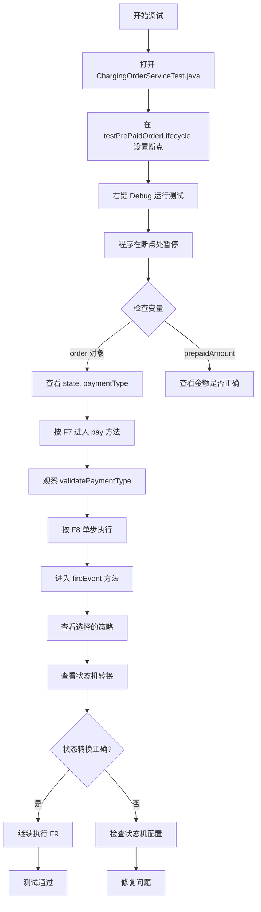

# 🔧 调试工具汇总
## Debugging Tools Summary

---

## 📦 已创建的调试资源

### 1. **调试指南文档** 📖
- **文件**: [DEBUG_GUIDE.md](file:///Users/zhengshoudong/.gemini/antigravity/scratch/charging-order-system/DEBUG_GUIDE.md)
- **内容**: 
  - IDE 断点调试详细步骤
  - 日志调试配置和使用
  - 单元测试调试技巧
  - 远程调试设置
  - COLA 状态机调试方法
  - 常见问题排查

### 2. **IDEA 调试速查表** 🎯
- **文件**: [IDEA_DEBUG_GUIDE.md](file:///Users/zhengshoudong/.gemini/antigravity/scratch/charging-order-system/IDEA_DEBUG_GUIDE.md)
- **内容**:
  - 快捷键速查
  - 断点设置最佳位置
  - 高级调试技巧（条件断点、日志断点、监视表达式）
  - 调试面板使用说明
  - 典型调试场景示例

### 3. **交互式调试脚本** 🚀
- **文件**: [debug.sh](file:///Users/zhengshoudong/.gemini/antigravity/scratch/charging-order-system/debug.sh)
- **功能**:
  - 运行所有测试
  - 运行单个测试
  - 调试模式运行
  - 查看/监控日志
  - 搜索日志
  - 生成测试覆盖率报告

### 4. **日志配置文件** 📝
- **文件**: [logback-spring.xml](file:///Users/zhengshoudong/.gemini/antigravity/scratch/charging-order-system/src/main/resources/logback-spring.xml)
- **配置**:
  - 控制台和文件双输出
  - DEBUG 级别日志
  - COLA 状态机日志追踪

### 5. **调试速查图** 🎨
- **文件**: 调试快捷键和面板参考图
- **内容**: 可视化的快捷键和调试面板说明

---

## 🚀 快速开始

### 方式 1: 使用 IntelliJ IDEA（推荐）

```bash
# 1. 打开项目
idea /Users/zhengshoudong/.gemini/antigravity/scratch/charging-order-system

# 2. 打开测试文件
src/test/java/com/charging/order/ChargingOrderServiceTest.java

# 3. 在关键位置设置断点（点击行号左侧）
#    推荐位置：
#    - ChargingOrderService.pay() 方法
#    - ChargingOrderService.fireEvent() 方法
#    - PrePaidStrategy.buildStateMachine() 方法

# 4. 右键测试方法 → Debug 'testPrePaidOrderLifecycle()'

# 5. 使用快捷键控制执行：
#    - F8: 单步跳过
#    - F7: 单步进入
#    - F9: 继续执行
```

---

### 方式 2: 使用调试脚本

```bash
# 进入项目目录
cd /Users/zhengshoudong/.gemini/antigravity/scratch/charging-order-system

# 运行交互式调试菜单
./debug.sh

# 选择操作：
# 1) 运行所有测试
# 2) 运行 PrePaid 生命周期测试
# 3) 运行 PostPaid 生命周期测试
# 7) 查看最新日志
# 8) 实时监控日志
```

---

### 方式 3: 使用命令行

```bash
# 运行单个测试
mvn test -Dtest=ChargingOrderServiceTest#testPrePaidOrderLifecycle

# 查看日志
tail -f logs/charging-order-system.log

# 搜索特定订单的日志
grep "订单ID" logs/charging-order-system.log
```

---

## 🎯 调试关键位置

### 1. Service 层（业务逻辑）
```java
// ChargingOrderService.java
File: src/main/java/com/charging/order/app/service/ChargingOrderService.java

关键方法：
- pay()           # 第 66 行：先付模式支付
- authorize()     # 第 109 行：后付模式授权
- fireEvent()     # 第 207 行：状态机触发
```

### 2. 策略层（状态机配置）
```java
// PrePaidStrategy.java
File: src/main/java/com/charging/order/domain/strategy/PrePaidStrategy.java

关键方法：
- buildStateMachine()  # 构建状态机
```

### 3. 测试层
```java
// ChargingOrderServiceTest.java
File: src/test/java/com/charging/order/ChargingOrderServiceTest.java

测试方法：
- testPrePaidOrderLifecycle()   # 第 33 行：先付模式完整流程
- testPostPaidOrderLifecycle()  # 第 69 行：后付模式完整流程
```

---

## 📊 调试流程示例

### 场景：调试先付模式支付流程



---

## 🔍 常用调试命令

### Maven 命令

```bash
# 运行所有测试
mvn clean test

# 运行单个测试类
mvn test -Dtest=ChargingOrderServiceTest

# 运行单个测试方法
mvn test -Dtest=ChargingOrderServiceTest#testPrePaidOrderLifecycle

# 跳过测试编译
mvn install -DskipTests

# 生成测试覆盖率报告
mvn clean test jacoco:report
```

### 日志命令

```bash
# 查看最新 50 行日志
tail -n 50 logs/charging-order-system.log

# 实时监控日志
tail -f logs/charging-order-system.log

# 搜索包含 "ERROR" 的日志
grep "ERROR" logs/charging-order-system.log

# 搜索特定订单 ID
grep "9233362f" logs/charging-order-system.log

# 统计日志中的错误数量
grep -c "ERROR" logs/charging-order-system.log
```

---

## 💡 调试技巧摘要

### ✅ 推荐做法

1. **在方法入口设置断点**
   - 可以查看输入参数
   - 确认方法是否被调用

2. **使用条件断点**
   - 只在特定条件下暂停
   - 例如：`order.getState() == OrderState.CREATED`

3. **添加监视表达式**
   - 持续监控关键变量
   - 例如：`order.getPrepaidAmount().subtract(order.getOrderAmount())`

4. **结合日志调试**
   - 查看完整的执行流程
   - 状态机转换日志非常有用

5. **逐步缩小范围**
   - 从外层方法开始
   - 逐步深入到问题代码

---

## 🎓 学习资源

### 文档

- [DEBUG_GUIDE.md](file:///Users/zhengshoudong/.gemini/antigravity/scratch/charging-order-system/DEBUG_GUIDE.md) - 完整调试指南
- [IDEA_DEBUG_GUIDE.md](file:///Users/zhengshoudong/.gemini/antigravity/scratch/charging-order-system/IDEA_DEBUG_GUIDE.md) - IDEA 调试速查

### 在线资源

- [IntelliJ IDEA 调试教程](https://www.jetbrains.com/help/idea/debugging-code.html)
- [Java 调试最佳实践](https://www.baeldung.com/java-debugging)
- [COLA 状态机文档](https://github.com/alibaba/COLA)

---

## 📞 下一步

### 推荐操作：

1. **阅读调试指南**
   ```bash
   # 用你喜欢的编辑器打开
   open DEBUG_GUIDE.md
   ```

2. **尝试运行测试**
   ```bash
   # 使用交互式脚本
   ./debug.sh
   
   # 或直接运行测试
   mvn test
   ```

3. **在 IDEA 中实践调试**
   - 打开 `ChargingOrderServiceTest.java`
   - 设置几个断点
   - Debug 运行测试
   - 使用 F7/F8 单步执行

4. **查看日志输出**
   ```bash
   tail -f logs/charging-order-system.log
   ```

---

## ✨ 测试结果

刚才运行的测试结果：

```
✅ Tests run: 1, Failures: 0, Errors: 0, Skipped: 0
✅ BUILD SUCCESS
```

**测试日志摘要：**
```
Created PRE_PAID order: 9233362f-8c5b-444f-81b7-34775475221b
Order paid with amount: 100.00
State machine fired event PAY: CREATED -> PAID
Order started charging
State machine fired event START_CHARGING: PAID -> CHARGING
Order finished charging. Amount: 50.5 kWh, Cost: 60.00
State machine fired event FINISH_CHARGING: CHARGING -> COMPLETED
Order settled. Refund amount: 40.00
State machine fired event SETTLE: COMPLETED -> CLOSED
```

所有状态转换都正常工作！✨

---

**祝您调试顺利！Have fun debugging! 🐛→✨**
